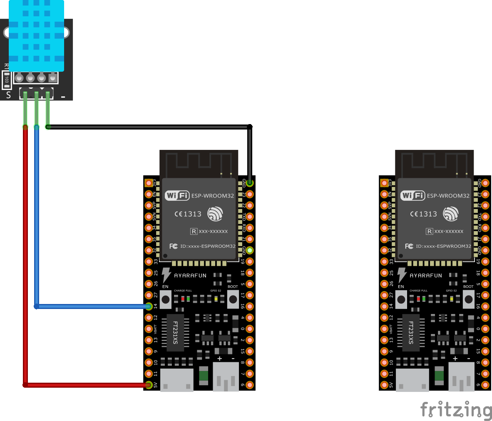

# espNow
A simple project to connect two esp32 using the espnow protocol. 
A master reading data from a DHT11 sensor and a slave that receive the data and push a request to thingspeak

## Geting Started

This project requires: 
2 Esp32 boads
1 DHT-11 sensor

The 'master' esp32 will read the data from dht11 at some interval, and then sending to the slave using the esp32-now protocol. 
Instead of setting the slave in AP mode and broadcasting the MAC address, the master node have it already hardcoded, and it will simply try to connect to the slave, if the slave it's not connected , sending data will fail. Once the slave esp32 start. it will start receiving data from the master and pushing to thingspeak using an HTTP request. 

## Notes

*  To make the esp32 works using the espNow and thw WIFI , they need to be on the same channel. In that case  I set them to channel 1 and the same to my wifi network.
*  The callback running on the slave node runs on core 0 If the HTTP request is on the callback the request fails and it ends up restarting the board. The solution was to put the request in the loop() that runs on core 1 and use some logic to send the request when new data arrived. 
